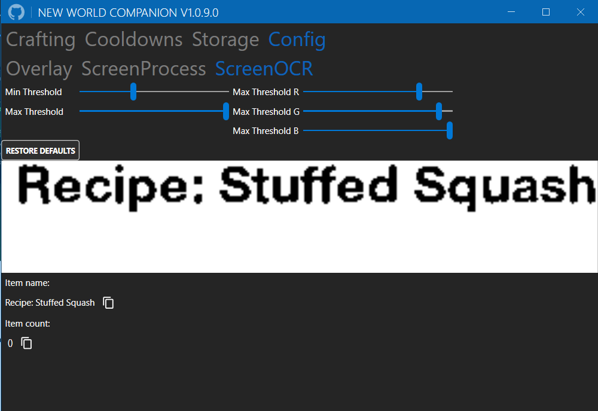

# NewWorldCompanion

A companion app for New World, to keep track of all your learned recipes and current trading post prices.

## Table of Contents

- [Features](https://github.com/josdemmers/NewWorldCompanion#features)
- [Planned Features](https://github.com/josdemmers/NewWorldCompanion#planned-features)
- [Installation](https://github.com/josdemmers/NewWorldCompanion#installation)
- [Configuration](https://github.com/josdemmers/NewWorldCompanion#configuration)
- [Usage](https://github.com/josdemmers/NewWorldCompanion#Usage)
- [Troubleshooting](https://github.com/josdemmers/NewWorldCompanion#Troubleshooting)
- [Feature show off](https://github.com/josdemmers/NewWorldCompanion#feature-show-off)

## Features

- Keep track of your learned recipes.
- Monitor all your cooldowns.
- Ingame overlay with price data for tradable items.
  - Supported servers: The server list is updated at each application launch. For the complete list of supported servers check: https://nwmarketprices.com/

## Planned Features

- [x] Add configuration section to make it easier to setup the app for different resolutions.
- [x] Keep track of the storage content of all towns in Aeternum.
- [x] Add timers to keep track of your cooldowns. e.g. elite chest runs, gypsum.
- [x] Add pricing data for items you hover your mouse over.
- [x] Add overlay to show recipe learned status directy in-game.
- [ ] ~~Add localisation for items. Currently English only.~~
- [ ] ~~Crafting cost calculator.~~

## Installation

- Download the latest version from [Releases](https://github.com/josdemmers/NewWorldCompanion/releases)
- Extract files and run NewWorldCompanion.exe
  - Go to configuration and select the preset matching your resolution. 
- Updating from an previous version? Make sure to copy your Config folder to keep your current progress.

## Configuration

Note: Default settings are tested running New World with Window Mode: Fullscreen.

### Item tooltips

The app uses the tooltip of an item to read the item name. There are configuration presets for the resolutions 1920x1080, 2560x1440 and 3840x2160. To make it work with other configurations you can tweak the following settings.
- Hysteresis thresholds: The lower you set those thresholds the more objects it will detect. This setting is unrelated to your resolution and the default value should work in most cases.
- Area thresholds: The min and max values for this threshold depend on your resolution. It is used to filter out unrelated objects so that only the item tooltip is recognized. The values are correct when you see a single orange outline around the item icon. As shown in the image below. If you do not see an outline start with the lowest min value and the highest max value. Then increase the min value step-by-step, and decrease the max value step-by-step. Do not keep those settings at their lowest/highest values as that will detect many other objects besides the item tooltip.

### OCR

The threshold values for OCR are used to filter out background noise. Your threshold values are correct if you only see black text on a white background.

### Overlay

Select which server to use the price data from. Price data is from https://nwmarketprices.com/.

## Usage

1. Counter for each crafting category showing your missing recipes.
2. Toggle button for each crafting category to filter the recipe list.
3. Filter / Search field for recipe list.
4. Toggle button to turn on/off the in-game item tooltip detection.
5. Info panel of the current selected recipe. Use the checkbox to change the learned state.
6. List of all recipes.

First make sure you have read the [Configuration](https://github.com/josdemmers/NewWorldCompanion#configuration) section and the detection of tooltips is working.

Using the app for the first time requires some extra work. You'll have to visit each of the crafting stations in-game and check the recipes you have already learned. Select the recipe in the app and click the checkmark when you have already learned the recipe.

If you have selected which server to use for the price data you're done. Start playing the game, now when you want to lookup price data of an item simply hover your mouse over the item. For tradable items it will show the price data, for recipes it will show the learned status as well.

1. Enter name for cooldown.
2. Add cooldown.
3. Reset cooldown timer.
4. Configure cooldown timer.
5. Delete cooldown timer.

1. Filter items in storage.
2. Show/hide preferred storages using checkbox.
3. Current selected storage.
4. Remove all items from selected storage.
5. Toggle item recording for selected storage.

## Troubleshooting

### The configuration page ScreenProcess does not show an orange outline around the item icon.

- Use the area threshold sliders if you have another resolution than the available presets.
- Make sure your monitor and ingame resolution are the same.

## Feature show off

Price overlay with recipe learned status used in the trading post.

Price overlay used in players inventory

## Licensing

MIT

## Thirdparty packages

- [Emgu CV](https://www.emgu.com/wiki/index.php/Main_Page)
- [GameOverlay.Net](https://github.com/michel-pi/GameOverlay.Net)
- [MahApps.Metro](https://github.com/MahApps/MahApps.Metro)
- [PInvoke](https://github.com/dotnet/pinvoke)
- [Prism](https://github.com/PrismLibrary/Prism)
- [TesserNet](https://github.com/CptWesley/TesserNet)

## Mentions

The available price data is from: https://nwmarketprices.com/
